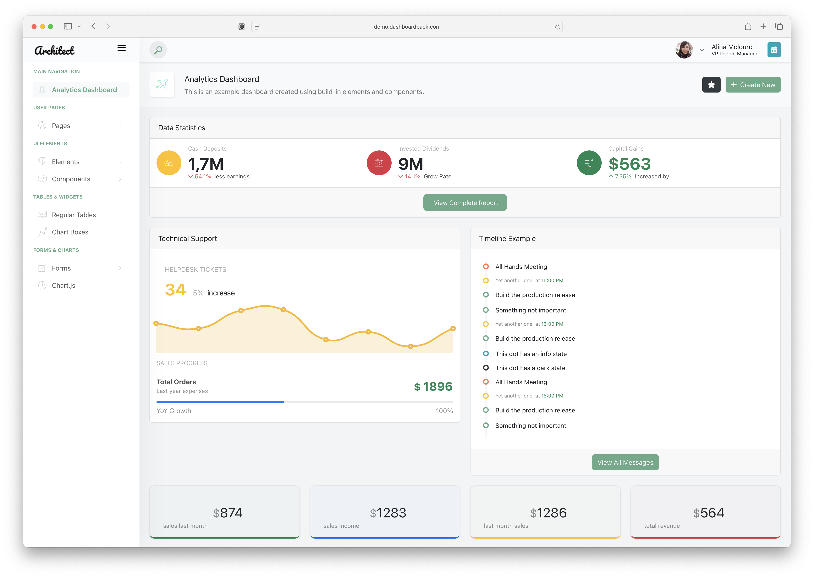

# ArchitectUI Vue 3 Admin Dashboard v2.1



**Live Demo**: [https://demo.dashboardpack.com/architectui-vue-free/](https://demo.dashboardpack.com/architectui-vue-free/)

[ArchitectUI](https://dashboardpack.com/theme-details/architectui-dashboard-html-pro) is one of the most popular admin dashboard templates ever released. It is used by thousands of developers to create webapps and SaaS totaling 100 million monthly active users. We have converted this template to support various frontend frameworks such as [Angular](https://dashboardpack.com/theme-details/architectui-angular-7-bootstrap-material-design-pro?v=7516fd43adaa), [Vue](https://dashboardpack.com/theme-details/architectui-dashboard-vue-pro) and [React](https://dashboardpack.com/theme-details/architectui-dashboard-react-pro?v=7516fd43adaa). This particular version of ArchitectUI is based on Vue 3 with modern tooling and best practices.

## 🚀 **Vue 3 Modernization Complete**

**Last Updated**: December 9, 2025

This template has been **completely modernized** and enhanced with significant improvements:

### **Latest Enhancements (December 2025)**

- **All Dependencies Updated**: Every package updated to the latest stable version
- **FontAwesome 7**: Upgraded to FontAwesome 7.x with improved icon designs
- **Vitest 4**: Modern testing framework with enhanced performance
- **Bootstrap-Vue-Next 0.40**: Latest component library with new features
- **Vue 3.5.25**: Latest Vue 3 with all optimizations
- **Vite 7.2**: Fastest build times with latest Vite
- **TypeScript 5.9**: Latest TypeScript support
- **Zero Vulnerabilities**: Complete security audit passed

### **Core Modernization Features**

- ✅ **Zero vulnerabilities** - all dependencies at latest secure versions
- ✅ **Vue 3.5.25** with latest features and optimizations
- ✅ **Modern build system** with Vite 7.2
- ✅ **Vue 3 Composition API** throughout key components
- ✅ **Pinia 3.x** for state management
- ✅ **Bootstrap 5.3** integration with BootstrapVueNext 0.40
- ✅ **Chart.js 4.x** with modern API usage
- ✅ **FontAwesome 7** with tree-shaking optimization
- ✅ **TypeScript-ready** component structure
- ✅ **Vitest 4** for modern testing
- ✅ **Professional styling** with original design integrity maintained

## 📊 **Key Features**

### **Modern Architecture**

- **Vue 3 Composition API**: Clean, reusable component patterns
- **Pinia Store Management**: Centralized state with reactive updates
- **Vite Build System**: Fast development and optimized production builds
- **Bootstrap 5**: Latest styling framework with modern utilities
- **ESLint + Prettier**: Code quality and consistent formatting

### **Developer Experience**

- **Hot Module Replacement**: Lightning-fast development
- **Component Reusability**: Modular widget system
- **TypeScript Support**: Full type safety ready
- **Tree-shaking**: Optimized bundle sizes
- **Modern Testing**: Vitest integration ready

### **Dashboard Components**

- **Analytics Dashboard**: Real-time data visualization
- **Responsive Sidebar**: Mobile-first navigation
- **Interactive Charts**: Chart.js 4.x integration
- **Enhanced Header**: Professional layout with tooltips and indicators
- **User Management**: Authentication pages
- **UI Components**: Buttons, cards, modals, tables, forms

### **State Management**

- **Dashboard Store**: Analytics data and statistics
- **UI Store**: Theme, sidebar, and layout preferences
- **Notifications Store**: System messages and alerts
- **Persistent Settings**: LocalStorage integration

## 🛠️ **Technology Stack**

| Technology       | Version | Purpose            |
| ---------------- | ------- | ------------------ |
| Vue.js           | 3.5.25  | Frontend framework |
| Pinia            | 3.0.4   | State management   |
| Vite             | 7.2.7   | Build tool         |
| Bootstrap        | 5.3.8   | CSS framework      |
| BootstrapVueNext | 0.40.9  | Vue 3 components   |
| Chart.js         | 4.5.1   | Data visualization |
| FontAwesome      | 7.1.0   | Icons              |
| TypeScript       | 5.9.3   | Type safety        |
| Vitest           | 4.0.15  | Testing framework  |
| ESLint           | 9.39.1  | Code quality       |

## 🚀 **Getting Started**

### **Prerequisites**

- Node.js 18+
- npm 9+ or yarn 1.22+

### **Installation**

```bash
# Clone the repository
git clone https://github.com/DashboardPack/architectui-vue-theme-free.git
cd architectui-vue-theme-free

# Install dependencies
npm install

# Start development server
npm run serve

# Build for production
npm run build

# Run linter
npm run lint
```

### **Development Commands**

```bash
npm run serve        # Start development server (http://localhost:8087)
npm run build        # Build for production (with type-check)
npm run lint         # Run ESLint linter with auto-fix
npm run preview      # Preview production build
npm run test         # Run tests in watch mode
npm run test:run     # Run tests once
npm run format       # Format code with Prettier
npm run type-check   # Run TypeScript type checking
```

## 📁 **Project Structure**

```
src/
├── components/          # Reusable Vue components
│   ├── DashboardWidget.vue
│   └── StoreDemo.vue
├── stores/             # Pinia stores
│   ├── dashboard.js    # Analytics and dashboard data
│   ├── ui.js          # UI state and preferences
│   ├── notifications.js # System notifications
│   └── index.js       # Store exports
├── DemoPages/         # Demo pages by category
│   ├── Dashboards/    # Dashboard components
│   ├── Elements/      # UI elements
│   ├── Components/    # Interactive components
│   ├── Forms/         # Form components
│   └── UserPages/     # Authentication pages
├── Layout/            # Layout components
│   ├── Components/    # Header, Sidebar, Footer
│   └── Wrappers/      # Layout wrappers
└── assets/           # Static assets and styles
```

## 🎨 **Component Examples**

### **Using Pinia Stores**

```vue
<script setup>
import { useDashboardStore } from '@/stores/dashboard'
import { useUIStore } from '@/stores/ui'

const dashboardStore = useDashboardStore()
const uiStore = useUIStore()

// Access reactive data
const stats = dashboardStore.stats
const sidebarCollapsed = uiStore.sidebarCollapsed

// Call store actions
dashboardStore.refreshDashboard()
uiStore.toggleSidebar()
</script>
```

### **Reusable Dashboard Widget**

```vue
<template>
  <DashboardWidget
    stat-key="cashDeposits"
    icon-class="pe-7s-scissors"
    icon-bg-class="bg-warning"
  />
</template>
```

## 🔧 **Configuration**

### **Vite Configuration**

The project uses Vite for fast development and optimized builds. Configuration is in `vite.config.js`.

### **ESLint Configuration**

Code quality is enforced with ESLint. Configuration is in `.eslintrc.js`.

### **Store Configuration**

Pinia stores are configured in `src/stores/index.js` with persistence and devtools support.

## 🚦 **Migration Guide**

This template has been migrated from Vue 2 to Vue 3.5.17. Key changes include:

### **Vue 3.5.17 Features**

- **Composition API**: Modern reactive patterns with latest optimizations
- **defineComponent**: Better TypeScript support
- **Pinia**: Vue 3 native state management
- **Vite**: Fast build tooling
- **Latest Vue 3 optimizations**: Performance improvements and bug fixes

### **Breaking Changes Addressed**

- Updated all dependencies to Vue 3.5.17 compatible versions
- Migrated BootstrapVue to Bootstrap 5 + BootstrapVueNext
- Replaced Vuex with Pinia
- Updated FontAwesome integration
- Modernized Chart.js integration

## 📚 **Documentation**

### **Store Usage**

- **Dashboard Store**: Analytics data, statistics, todos
- **UI Store**: Sidebar state, theme management, mobile responsiveness
- **Notifications Store**: System messages and alerts

### **Component Patterns**

- Use `defineComponent` for better TypeScript support
- Leverage Composition API for reactive state
- Follow single responsibility principle
- Use stores for cross-component communication

## 🛡️ **Security & Dependencies**

- **Zero vulnerabilities**: All dependencies updated to secure versions
- **Modern dependencies**: Latest stable versions
- **Tree-shaking**: Optimized bundle sizes
- **CSP compatible**: Content Security Policy friendly

## 🤝 **Contributing**

1. Fork the repository
2. Create a feature branch
3. Make your changes
4. Run `npm run lint` to check code quality
5. Submit a pull request

## 📄 **License**

This template is provided for free with no support. It is actively maintained and all dependencies are kept updated. The template is safe to use in production.

## 🌟 **More Templates**

For more admin templates like this, please check out our [Github profile](https://github.com/DashboardPack) or [website](https://dashboardpack.com/).

---

## 🎯 **Perfect for Modern Development**

This Vue 3 modernized version of ArchitectUI provides developers with:

- **Modern tooling** for efficient development
- **Best practices** for Vue 3 applications
- **Production-ready** code structure
- **Zero vulnerabilities** for secure applications
- **Comprehensive documentation** for easy onboarding

Start building your next Vue 3 application with confidence! 🚀
